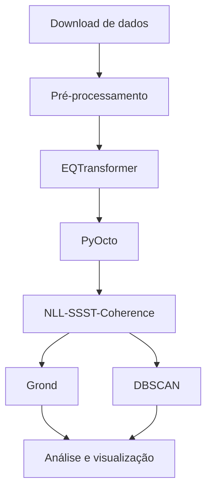

# Workflow

## Interfaces entre etapas

- **Download → Pré-processamento:** waveforms + StationXML/inventários.
- **Pré-processamento → EQTransformer:** dados organizados e metadados compatíveis.
- **EQTransformer → PyOcto:** picks P/S com tempo, estação e probabilidade.
- **PyOcto → NLL-SSST:** eventos associados + picks por evento.
- **NLL-SSST → Grond:** eventos relocalizados e selecção de waveforms.
- **NLL-SSST → DBSCAN:** catálogo hipocentral refinado.
- **Grond + DBSCAN → interpretação:** parâmetros de fonte, clusters e contexto sismotectónico.
